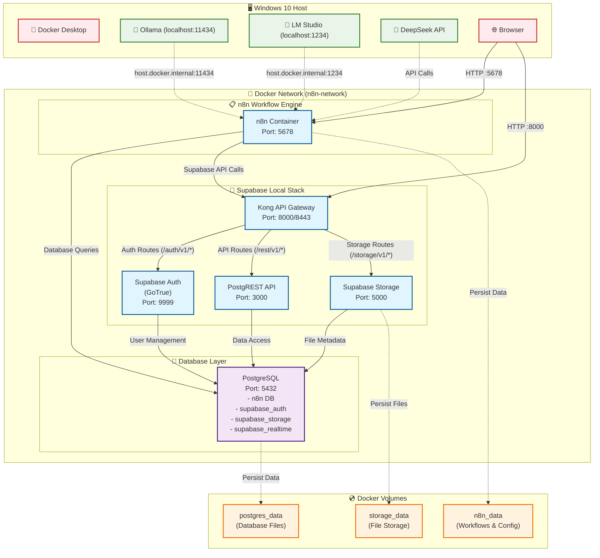
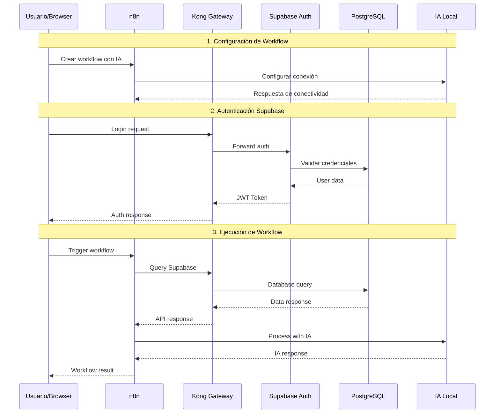

# Diagrama de Arquitectura - n8n + Supabase Local

## 🌐 Visualización Interactiva

**[Ver Diagrama Interactivo en Claude](https://claude.ai/public/artifacts/06dde787-00be-4c4e-b478-10e9fd773be6)**

*Accede al enlace para una visualización interactiva con zoom, navegación y detalles expandibles de cada componente.*

## Flujo de Datos

## Componentes Detallados

### 🔧 Servicios Core
- **n8n**: Motor de workflows y automatización
- **Kong**: API Gateway y proxy reverso
- **PostgreSQL**: Base de datos principal
- **GoTrue**: Servicio de autenticación
- **PostgREST**: API REST automática
- **Storage API**: Gestión de archivos

### 🤖 Integración con IAs
- **Ollama**: Modelos locales (Llama, Mistral, etc.)
- **LM Studio**: Interface para modelos locales
- **DeepSeek**: API externa de IA
- **Conexión**: Vía `host.docker.internal` para servicios en Windows

### 💾 Persistencia
- **n8n_data**: Workflows, credenciales, configuraciones
- **postgres_data**: Datos de usuarios, tablas, autenticación
- **storage_data**: Archivos subidos y multimedia

### 🌐 Endpoints Principales
- **n8n UI**: `http://localhost:5678`
- **Supabase API**: `http://localhost:8000`
- **PostgreSQL**: `localhost:5432`
- **Direct Services**: Acceso interno vía red Docker

## Beneficios de esta Arquitectura

1. **Aislamiento**: Cada servicio en su propio contenedor
2. **Escalabilidad**: Fácil añadir más servicios
3. **Persistencia**: Datos seguros en volúmenes
4. **Flexibilidad**: Compatible con múltiples IAs
5. **Desarrollo Local**: Sin dependencias externas
6. **Windows Compatible**: Configuración específica para W10